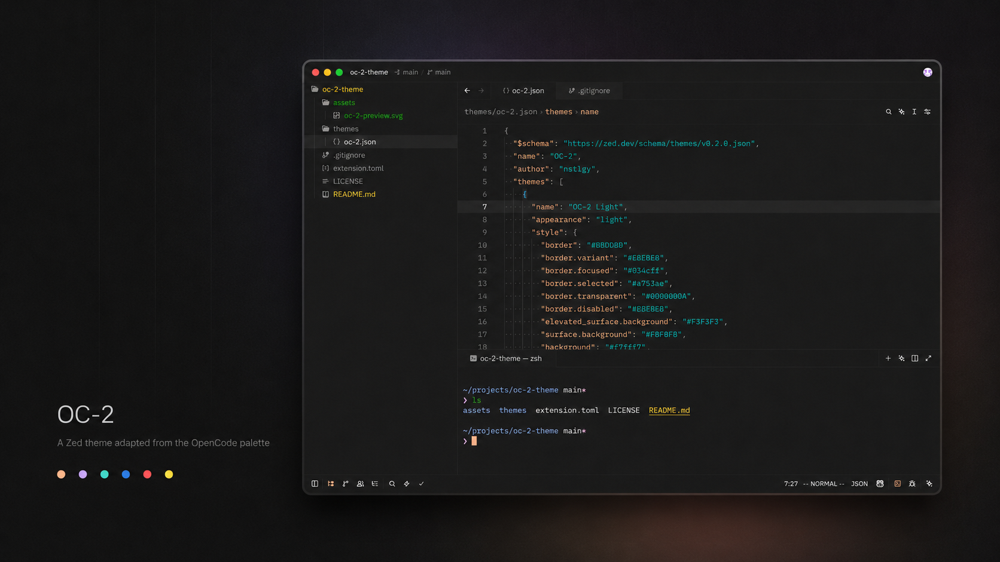

# OC-2 Theme for Zed



OC-2 is a warm, expressive theme for [Zed](https://zed.dev), adapted from the original [OpenCode](https://opencode.ai/) OC-2 color palette. It pairs soft neutral surfaces with vivid syntax accents, keeping the editor calm without making code feel muted.

<p>
  
  
  
</p>

## Variants

- `OC-2 Dark`
- `OC-2 Light`

## Palette

<p>
  
  
  
  
  
  
</p>

## Install

Once published in the Zed extension registry, install it from Zed's Extensions view by searching for `OC-2 Theme`.

For local development or manual testing:

1. Clone this repository.
2. Open Zed.
3. Run `zed: install dev extension` from the command palette.
4. Select this repository directory.
5. Choose `OC-2 Dark` or `OC-2 Light` from the theme picker.

## Manual Theme File

You can also copy the theme JSON directly into Zed's user themes directory:

```sh
mkdir -p ~/.config/zed/themes
cp themes/oc-2.json ~/.config/zed/themes/oc-2.json
```

Then reload Zed and select one of the OC-2 themes.

## Credits

The original OC-2 theme and color palette were created by [OpenCode](https://opencode.ai/). This repository is an unofficial Zed editor adaptation by [nstlgy](https://github.com/nstlgy).

## License

MIT
